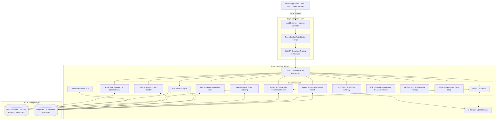
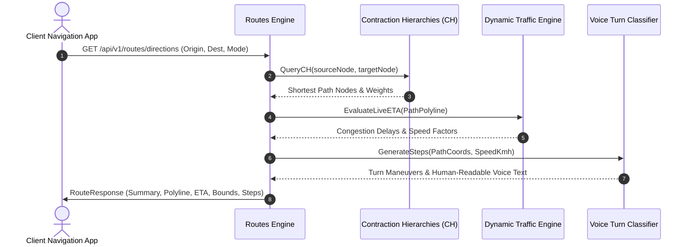
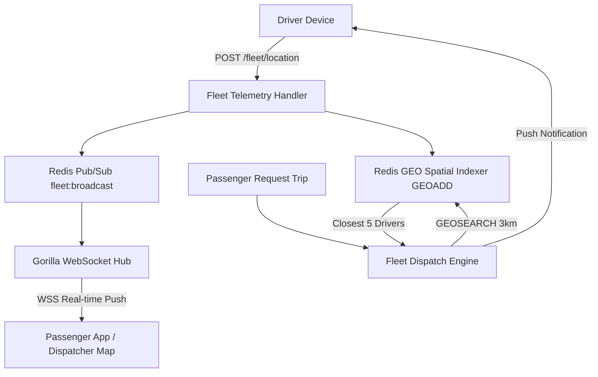
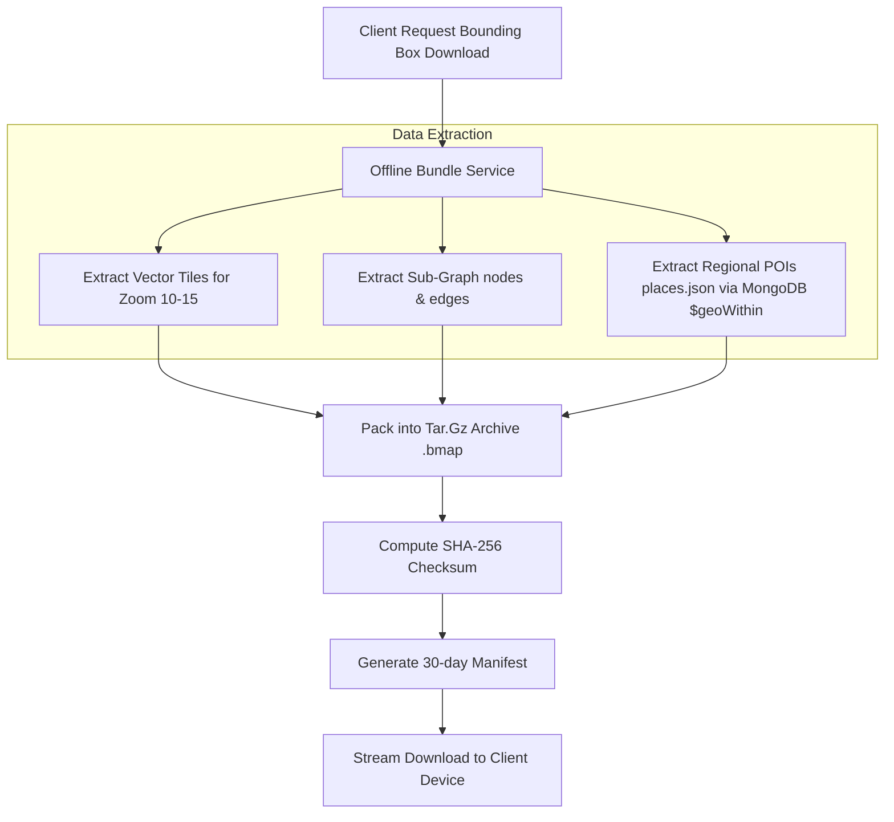

# B-Map Architecture & System Design 🗺️📐

This document provides a comprehensive technical blueprint of the **B-Map Navigation & Mapping Platform Backend**.

---

## 1. 🏗️ High-Level System Architecture



---

## 2. 🧠 The Routing & Contraction Hierarchies (CH) Engine

The routing engine calculates optimal paths across millions of road network segments in sub-milliseconds:



---

## 3. ⚡ Multi-Tier Caching Architecture

To achieve sub-millisecond latency for vector tiles, styles, and repetitive route queries, B-Map utilizes a **two-tier caching model**:

```mermaid
flowchart LR
    Req[Incoming Client Request] --> L1{L1 In-Memory LRU Cache}
    L1 -->|Hit (< 100μs)| Res[Return Cached Data]
    L1 -->|Miss| L2{L2 Redis 7 Cache}
    L2 -->|Hit (< 2ms)| CacheL1[Populate L1] --> Res
    L2 -->|Miss| DB[(MongoDB 7.0)]
    DB --> ExecQuery[Execute 2dsphere Spatial Query $geoNear / $geoWithin]
    ExecQuery --> CacheL2[Populate L2 Redis]
    CacheL2 --> CacheL1
    CacheL1 --> Res
```

---

## 4. 🛰️ Real-Time Telemetry, Fleet Tracking & WebSockets



---

## 5. 🚦 Connected Vehicles (V2X) & Autonomous Driving Data Loop

### 5.1 V2X Municipal Signal Phase & Timing (SPaT)
- Real-time streaming of traffic signal states (`GREEN`, `YELLOW`, `RED`, `PROTECTED_TURN_GREEN`).
- **GLOSA (Green Light Optimal Speed Advisory)**:
  $$V_{advisory} = \frac{DistanceToIntersection}{TimeRemainingToGreen}$$
  Advises the vehicle to cruise at optimal speed to pass intersections without stopping.

### 5.2 HD Map Data Loop
- Crowdsourced sensor observations from autonomous vehicles (camera detections, LiDAR anomalies, construction cones, potholes).
- Multi-vehicle consensus engine verifies observations ($\ge 0.85$ confidence score) and automatically updates dynamic road layers.

---

## 6. 📦 Offline Map Sync (Bounding Box Bundler)



---

## 7. 🗄️ Database Collections & 2dsphere Spatial Indexes

| Collection | Geospatial Field | Index Type | Purpose |
|---|---|---|---|
| `places` | `location ({ type: "Point", coordinates: [lng, lat] })` | `2dsphere` | Spherical distance & bounding box queries (`$geoNear`, `$geoWithin`) |
| `places` | `name, description, address` | `text` / `regex` | High-speed typo-tolerant autocomplete |
| `vehicles` | `location ({ type: "Point", coordinates: [lng, lat] })` | `2dsphere` | Proximity driver search and dispatch |
| `trips` | `pickup_location, dropoff_location` | `2dsphere` | Mission pickup/dropoff geospatial queries |
| `boundaries`| `center_point ({ type: "Point", coordinates: [lng, lat] })` | `2dsphere` | Territorial and jurisdiction search |
| `road_nodes`| `location ({ type: "Point", coordinates: [lng, lat] })` | `2dsphere` | Map matching & nearest road node snap |
| `users` | `email` | `unique (1)` | Fast identity & auth lookups |

---

## 8. 🛡️ Security, Rate Limiting & Resilience
- **Rate Limiting**: 150 req/sec per IP with 300 burst allowance via Token Bucket.
- **OWASP Compliance**: HTTP security headers (`X-Content-Type-Options`, `X-Frame-Options`, `X-XSS-Protection`).
- **Cryptographic OTPs**: `crypto/rand` generation, Redis TTL, atomic single-use deletion.
- **Observability**: Prometheus metrics at `/metrics` tracking throughput, error rates, and connection gauges.
